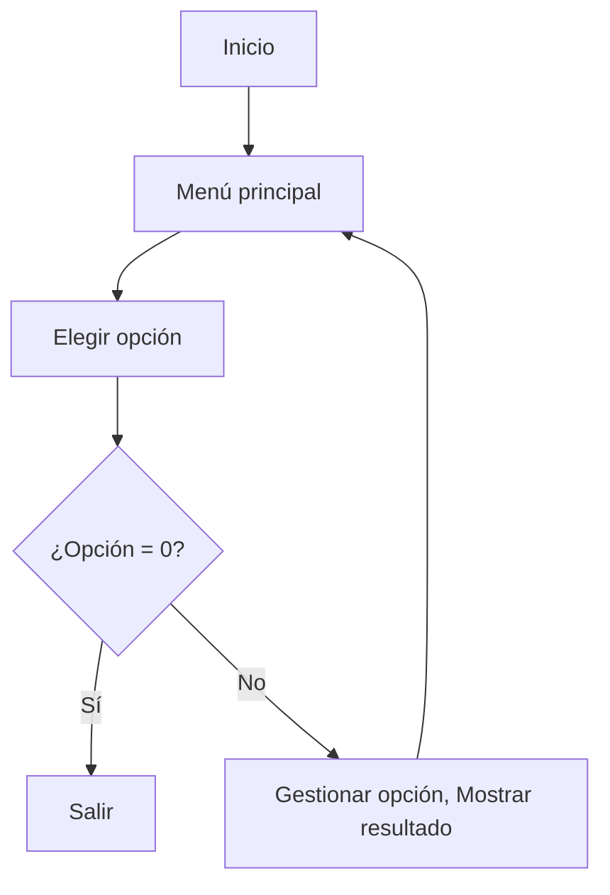

# literAlura-one8

## 📌 Índice
1. [Descripción](#-descripción)
2. [Funcionalidades](#-funcionalidades)  
3. [Tecnologías](#-tecnologías-utilizadas)
4. [Requisitos](#-requisitos-del-sistema)
5. [Instalación](#-instalación)
6. [Uso](#%EF%B8%8F-uso)
7. [Estructura](#%EF%B8%8F-estructura-del-código)
8. [Flujo](#-flujo-de-la-aplicación)
9. [Desarrollador](#-desarrollador)

## 🌟 Descripción
Catálogo de Libros que ofrece interacción textual (vía consola) con los usuarios,
proporcionando al menos 5 opciones de interacción. 
Los libros se buscarán a través de la API [Gutendex](https://gutendex.com/).

**Características principales**:
- Consulta libros de la API [Gutendex](https://gutendex.com/) 
- Registra en base de datos libros y autores
- Interfaz intuitiva por consola

## 🚀 Funcionalidades
| # | Función | Descripción |
|---|---------|-------------|
| 1 | Buscar libro por título | Usa libros de la API y los que ya están en base de datos |
| 2 | Listar libros registrados | Permite mostrar los libros registrados en base de datos |
| 3 | Listar autores registrados | Permite mostrar los autores registrados en base de datos |
| 4 | Listar autores vivos en un determinado año | Recibe un año como parámetro y muestra los autores que estaban vivos este año |
| 5 | Listar libros por idioma | Recibe como parámetro un idioma ("es", "en", "fr", "pt", "it", "fi") |
| 6 | Generar estadísticas de libros registrados | Muestra estadísticas según el número de descargas de cada libro en base de datos |
| 7 | Generar estadísticas de libros Api | Muestra estadísticas según el número de descargas de cada libro de la API (Primeras 20 páginas) |
| 8 | Top 10 Api | Muestra top 10 según el número de descargas de cada libro de la API (Primeras 20 páginas) |
| 9 | Top 10 Libros registrados | Muestra top 10 según el número de descargas de cada libro registrado en base de datos |
| 10 | Buscar Autor por nombre | Muestra autores que contengan en su nombre una cadena de caracteres ingresada como parámetro |

## 💻 Tecnologías Utilizadas
```java
// Stack técnico
- Java 24
- Spring Boot 3.5.0
- Maven
- Postgresql 42.7.5
- jackson 2.19.0
- Java HttpClient
```

## 📋 Requisitos del Sistema
- JDK 17 o superior
- Postgresql
- Conexión a internet
- IDE IntelliJ IDEA

## 🔧 Instalación
```bash
# 1. Clonar repositorio
git clone https://github.com/WilmarDeML/literAlura-one8.git
cd literAlura-one8

# 2. Abrir con intellij
    ° Click derecho > abrir con > (Versión de intellij instalado)

# 3. Configurar base de datos Postgresql local
    ° cambiar o agregar variables de entorno para string de conexión:
      ° DB_HOST
      ° DB_NAME
      ° DB_USERNAME
      ° DB_PASS
    ° crear base de datos si no existe con el nombre que pongas en DB_NAME
```

## 🖥️ Uso
Seleccionar una de las opciones del menú a través de su número y seguir las instrucciones en adelante:<br>
   


## 🏗️ Estructura del Código
| Paquete | Archivo | Responsabilidad |
|---------|---------|-----------------|
| raiz | `LiteraluraApplication.java` | Punto de entrada |
| raiz | `Principal.java` | Lógica de UI y flujo |
| modelos | `*.java` | Modela las entidades a bd y records para mapear la respuesta de la api |
| repositorios | `*.java` | Comunicación con las tablas de la base de datos |
| servicios/serv | `*.java` | Contratos para la implementación de los servicios de la lógica del negocio |
| servicios/impl | `*.java` | Implementación de los servicios (lógica de nogocio), interactúan con los repositorios |
| servicios/impl/client | `ConsumoApi.java` | Implementación de la lógica para el consumo de la API |
| util | `ConvierteDatos.java` | Mapea jsons de String a un modelo específico |

## 🔄 Flujo de la Aplicación


## ✨ Desarrollador

**Creado por**: WilmarDeMelquisedecLisbet

[](https://github.com/WilmarDeML)
[](https://linkedin.com/in/wilmardeml-dev)

📌 *¿Problemas o sugerencias?*  
Abre un [issue](https://github.com/WilmarDeML/literAlura-one8/issues) en el repositorio.

